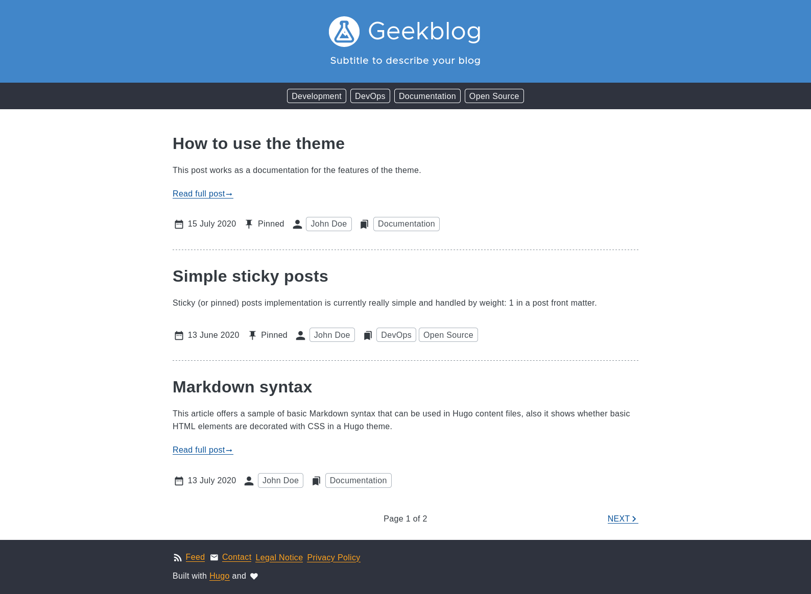

# Hugo Geekblog Theme

geekblog is a simple Hugo theme for personal blogs. This work is inspired and partially based on the [hugo-book](https://github.com/alex-shpak/hugo-book) theme. You can find a demo and the full documentation at [https://hugo-geekblog.geekdocs.de](https://hugo-geekblog.geekdocs.de).

## License

This project is licensed under the MIT License - see the [LICENSE](LICENSE) file for details.

## Maintainers and Contributors

[Robert Kaussow](https://github.com/xoxys)
