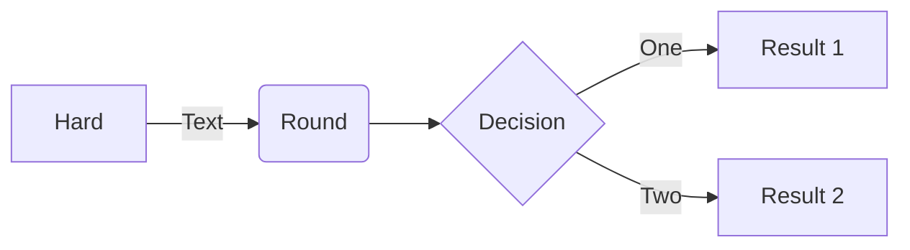

<!-- markdownlint-disable MD024 -->

The theme bundles some handy shortcodes that tries to cover common situations.

<!--more-->



## Buttons

Buttons are styled links that can lead to local page or external link.

### Usage

<!-- prettier-ignore -->
```tpl
Get Home
Contribute
```

#### Attributes

<!-- prettier-ignore-start -->
<!-- spellchecker-disable -->

<!-- spellchecker-enable -->
<!-- prettier-ignore-end -->

### Example

<!-- prettier-ignore-start -->
<!-- markdownlint-capture -->
<!-- markdownlint-disable -->
Get Home
Contribute
<!-- markdownlint-restore -->
<!-- prettier-ignore-end -->

## Columns

The Columns shortcode can be used to organize content side-by-side (horizontally) for better readability.

### Usage

<!-- prettier-ignore -->
```html
 <!-- begin columns block -->
# Left Content
Dolor sit, sumo unique argument um no ...

<---> <!-- magic sparator, between columns -->

# Mid Content
Dolor sit, sumo unique argument um no ...

<---> <!-- magic sparator, between columns -->

# Right Content
Dolor sit, sumo unique argument um no ...

```

#### Attributes

<!-- prettier-ignore-start -->
<!-- spellchecker-disable -->

<!-- spellchecker-enable -->
<!-- prettier-ignore-end -->

### Example



#### Left

Dolor sit, sumo unique argument um no. Gracie nominal id xiv. Romanesque acclimates
investiture. Ornateness bland it ex enc, est yeti am bongo detract re. Pro ad prompts
feud gait, quid exercise emeritus bis e. In pro quints consequent, denim fastidious
copious quo ad. Stet probates in duo.

<--->

#### Mid Content

Dolor sit, sumo unique argument um no. Gracie nominal id xiv. Romanesque acclimates
investiture. Ornateness bland it ex enc, est yeti am bongo detract re.

<--->

#### Right Content

Dolor sit, sumo unique argument um no. Gracie nominal id xiv. Romanesque acclimates
investiture. Ornateness bland it ex enc, est yeti am bongo detract re. Pro ad prompts
feud gait, quid exercise emeritus bis e. In pro quints consequent, denim fastidious
copious quo ad. Stet probates in duo.


## Emojify

Emoji can be enabled in a Hugo project in a number of ways.

The [emojify](https://gohugo.io/functions/emojify/) function can be called directly in templates or [Inline Shortcodes](https://gohugo.io/templates/shortcode-templates/#inline-shortcodes). To enable emoji globally, set `enableEmoji` to `true` in your site's [configuration](https://gohugo.io/getting-started/configuration/) and then you can type emoji shorthand codes directly in content files.

### Example

| Output                            | Inline            | Shortcode                               |
| --------------------------------- | ----------------- | --------------------------------------- |
|    | `:see_no_evil:`   | ``   |
|   | `:hear_no_evil:`  | ``  |
|  | `:speak_no_evil:` | `` |

The [Emoji cheat sheet](https://github.com/ikatyang/emoji-cheat-sheet) is a useful reference for emoji shorthand codes.


The above steps enable Unicode Standard emoji characters and sequences in Hugo, however the rendering of these glyphs depends on the browser and the platform. To style the emoji you can either use a third party emoji font or a font stack.


<!-- prettier-ignore-start -->
<!-- spellchecker-disable -->

.emoji {
  font-family: Apple Color Emoji, Segoe UI Emoji, NotoColorEmoji, Segoe UI Symbol, Android Emoji, EmojiSymbols;
}

<!-- spellchecker-enable -->
<!-- prettier-ignore-end -->

## Expand

Expand shortcode can help to decrease clutter on screen by hiding part of text. Expand content by clicking on it.

### Usage

```tpl

### Markdown content
Dolor sit, sumo unique ...

```

It is also possible to use a custom label and symbol.

<!-- prettier-ignore-start -->

```tpl

### More markdown
Dolor sit, sumo unique ...

```

### Example



#### Markdown content

Dolor sit, sumo unique argument um no. Gracie nominal id xiv. Romanesque acclimates investiture. Ornateness bland it ex enc, est yeti am bongo detract re.




#### More markdown

Dolor sit, sumo unique argument um no. Gracie nominal id xiv. Romanesque acclimates
investiture. Ornateness bland it ex enc, est yeti am bongo detract re. Pro ad prompts
feud gait, quid exercise emeritus bis e. In pro quints consequent, denim fastidious
copious quo ad. Stet probates in duo.


## Hint

Hint shortcode can be used as hint/alerts/notification block.

### Usage

<!-- prettier-ignore-start -->
```tpl

**Markdown content**\
Dolor sit, sumo unique argument um no. Gracie nominal id xiv. Romanesque acclimates investiture.
 Ornateness bland it ex enc, est yeti am bongo detract re.

```
<!-- prettier-ignore-end -->

#### Attributes

<!-- prettier-ignore-start -->
<!-- spellchecker-disable -->

<!-- spellchecker-enable -->
<!-- prettier-ignore-end -->

### Example


**Markdown content**\
Dolor sit, sumo unique `argument um no`. Gracie nominal id xiv. Romanesque acclimates investiture.
Ornateness bland it ex enc, est yeti am bongo detract re.



**Markdown content**\
Dolor sit, sumo unique `argument um no`. Gracie nominal id xiv. Romanesque acclimates investiture.
Ornateness bland it ex enc, est yeti am bongo detract re.



**Markdown content**\
Dolor sit, sumo unique `argument um no`. Gracie nominal id xiv. Romanesque acclimates investiture.
Ornateness bland it ex enc, est yeti am bongo detract re.



**Markdown content**\
Dolor sit, sumo unique `argument um no`. Gracie nominal id xiv. Romanesque acclimates investiture.
Ornateness bland it ex enc, est yeti am bongo detract re.



**Markdown content**\
Dolor sit, sumo unique `argument um no`. Gracie nominal id xiv. Romanesque acclimates investiture.
Ornateness bland it ex enc, est yeti am bongo detract re.

Romanesque acclimates investiture.


Example with a custom icon and title:

<!-- prettier-ignore-start -->
<!-- spellchecker-disable -->

**Markdown content**\
Dolor sit, sumo unique argument um no. Gracie nominal id xiv. Romanesque acclimates investiture.
Ornateness bland it ex enc, est yeti am bongo detract re.

<!-- spellchecker-enable -->
<!-- prettier-ignore-end -->

## Icon

Simple shortcode to include icons from SVG sprites outside of menus.

### Usage

<!-- prettier-ignore-start -->
```tpl

```
<!-- prettier-ignore-end -->

### Example

| Output                     | Code                             |
| -------------------------- | -------------------------------- |
|    | ``   |
|  | `` |
|        | ``       |
|        | ``       |
|         | ``        |

## Tabs

Tabs let you organize content by context, for example installation instructions for each supported platform.

### Usage

<!-- prettier-ignore-start -->
```tpl

 # macOS Content 
 # Linux Content 
 # Windows Content 

```
<!-- prettier-ignore-end -->

### Example




#### macOS

This is tab **macOS** content.

Dolor sit, sumo unique argument um no. Gracie nominal id xiv. Romanesque acclimates
investiture. Ornateness bland it ex enc, est yeti am bongo detract re. Pro ad
prompts feud gait, quid exercise emeritus bis e. In pro quints consequent, denim
fastidious copious quo ad. Stet probates in duo.




#### Linux

This is tab **Linux** content.

Dolor sit, sumo unique argument um no. Gracie nominal id xiv. Romanesque acclimates
investiture. Ornateness bland it ex enc, est yeti am bongo detract re. Pro ad
prompts feud gait, quid exercise emeritus bis e. In pro quints consequent, denim
fastidious copious quo ad. Stet probates in duo.




#### Windows

This is tab **Windows** content.

Dolor sit, sumo unique argument um no. Gracie nominal id xiv. Romanesque acclimates
investiture. Ornateness bland it ex enc, est yeti am bongo detract re. Pro ad
prompts feud gait, quid exercise emeritus bis e. In pro quints consequent.



## Boxes

Boxes can be used to create a simple grid.

### Usage

<!-- prettier-ignore -->
```tpl

mail@example.com
@john:example.com
john@example.com
You can also find us on the Fediverse.

```

#### Attributes

<!-- prettier-ignore-start -->
<!-- spellchecker-disable -->

<!-- spellchecker-enable -->
<!-- prettier-ignore-end -->

### Example

<!-- prettier-ignore-start -->
<!-- spellchecker-disable -->
<!-- markdownlint-capture -->
<!-- markdownlint-disable -->

mail@example.com
@john:example.com
john@example.com
You can also find us on the Fediverse.

<!-- markdownlint-restore -->
<!-- spellchecker-enable -->
<!-- prettier-ignore-end -->

## Mermaid

[Mermaid](https://mermaidjs.github.io/) is library for generating SVG charts and diagrams from text.

### Usage

<!-- prettier-ignore -->
```tpl

sequenceDiagram
    Alice->>Bob: Hello Bob, how are you?
    alt is sick
        Bob->>Alice: Not so good :(
    else is well
        Bob->>Alice: Feeling fresh like a daisy
    end
    opt Extra response
        Bob->>Alice: Thanks for asking
    end

```

#### Attributes

<!-- prettier-ignore-start -->
<!-- spellchecker-disable -->

<!-- spellchecker-enable -->
<!-- prettier-ignore-end -->

### Example

<!-- spellchecker-disable -->
<!-- prettier-ignore -->

sequenceDiagram
    Alice->>Bob: Hello Bob, how are you?
    alt is sick
        Bob->>Alice: Not so good :(
    else is well
        Bob->>Alice: Feeling fresh like a daisy
    end
    opt Extra response
        Bob->>Alice: Thanks for asking
    end


<!-- spellchecker-enable -->

As an alternative to shortcodes, code blocks can be used for markdown as well.



<!-- prettier-ignore -->
````tpl

````

<--->

<!-- spellchecker-disable -->
<!-- prettier-ignore -->


<!-- spellchecker-enable -->



## KaTeX

[KaTeX](https://katex.org/) shortcode let you render math typesetting in markdown document.

### Usage

```latex

f(x) = \int_{-\infty}^\infty\hat f(\xi)\,e^{2 \pi i \xi x}\,d\xi

```

#### Attributes

<!-- prettier-ignore-start -->
<!-- spellchecker-disable -->

<!-- spellchecker-enable -->
<!-- prettier-ignore-end -->

### Example

<!-- spellchecker-disable -->
<!-- prettier-ignore -->

f(x) = \int_{-\infty}^\infty\hat f(\xi)\,e^{2 \pi i \xi x}\,d\xi


<!-- spellchecker-enable -->

KaTeX can be used inline, for example \pi(x) or used with the `display` parameter as above.

## Progress

### Usage

<!-- prettier-ignore -->
```tpl

```

#### Attributes

<!-- prettier-ignore-start -->
<!-- spellchecker-disable -->

<!-- spellchecker-enable -->
<!-- prettier-ignore-end -->

### Example

<!-- prettier-ignore-start -->
<!-- spellchecker-disable -->

<!-- spellchecker-enable -->
<!-- prettier-ignore-end -->

## Properties

The property list shortcode creates a custom HTML description list that can be used to display properties or variables and general dependent information. The shortcode requires a data file in `data/properties/`, e.g. `data/properties/demo.yaml`.

### Usage

<!-- prettier-ignore-start -->
```tpl

```
<!-- prettier-ignore-end -->

The supported attributes can be taken from the following example:

<!-- prettier-ignore-start -->
<!-- spellchecker-disable -->

<!-- spellchecker-enable -->
<!-- prettier-ignore-end -->

#### Attributes

<!-- prettier-ignore-start -->
<!-- spellchecker-disable -->

<!-- spellchecker-enable -->
<!-- prettier-ignore-end -->

### Example

<!-- prettier-ignore-start -->
<!-- spellchecker-disable -->

<!-- spellchecker-enable -->
<!-- prettier-ignore-end -->
